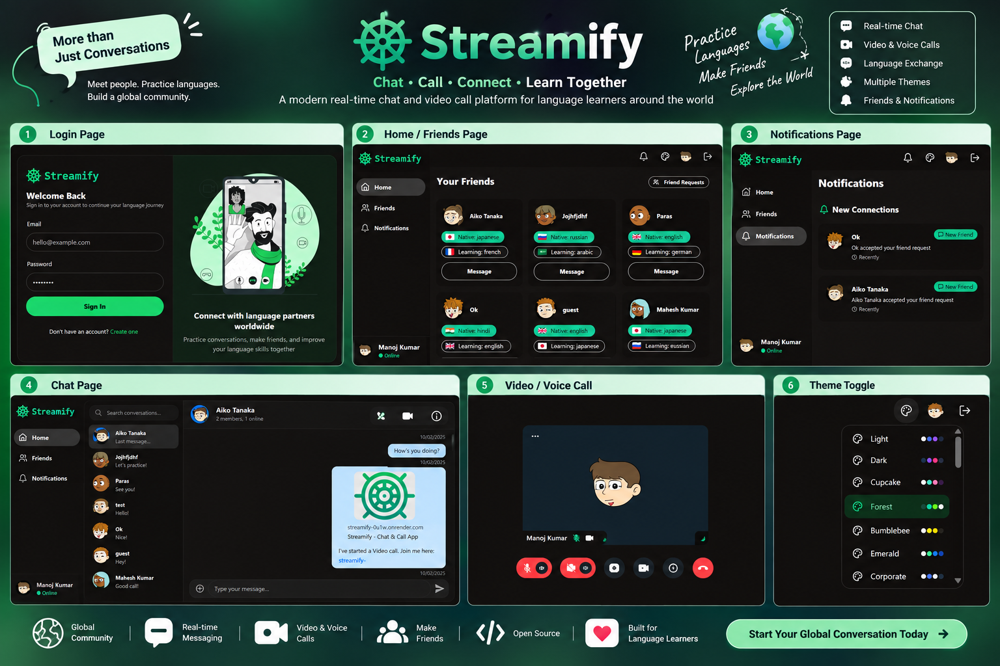

# Streamify

<p align="center">
  <strong>A full-stack language exchange platform with real-time chat and video calling.</strong><br/>
  Connect with language learners, build friendships, chat in real time, and practice together through video calls.
</p>

<p align="center">
  <a href="https://github.com/kumarmanoj231/Streamify">
    
  </a>
  <a href="https://streamify-0u1w.onrender.com">
    
  </a>
  
  
  
</p>

## Preview

<p align="center">
  
</p>

## What is Streamify?

Streamify is a MERN-based language exchange application designed to help people find language partners and communicate through **real-time chat and video calls**.

Users can create an account, complete a language-focused profile, discover other learners, send and accept friend requests, chat privately, and start video calls directly from a conversation.

The application uses **MongoDB** for user and friendship data and **Stream.io** for real-time messaging and video communication.

## Why Streamify?

Learning a language is easier when you can practice with real people. Streamify brings the discovery and communication workflow into one place:

- **Find language partners** based on language profiles.
- **Build a personal profile** with native and learning languages, bio, and location.
- **Connect with people** through friend requests.
- **Chat in real time** using Stream Chat.
- **Start video calls** directly from a chat.
- **Stay notified** about friend requests and new connections.
- **Use a responsive interface** built with React, Tailwind CSS, and DaisyUI.
- **Keep authentication secure** with JWTs stored in HTTP-only cookies.

## Core Features

### Authentication

- User registration and login
- Password hashing with `bcryptjs`
- JWT-based authentication
- HTTP-only authentication cookie
- Logout support
- Protected routes
- Onboarding flow for new users

### Language Profiles

Users can maintain:

- Full name
- Profile picture
- Bio
- Native language
- Learning language
- Location

### Language Partner Discovery

- Recommended language learners
- Friends list
- Native and learning language indicators
- Send friend requests
- Accept incoming requests
- Track outgoing requests

### Real-Time Communication

- One-to-one messaging with Stream Chat
- Message threads
- Real-time chat interface
- Video-call links shared directly in conversations
- Real-time video calls powered by Stream Video SDK

### User Experience

- Responsive layout
- Sidebar navigation
- Toast notifications
- Loading states
- Theme support through DaisyUI
- React Query for server-state management

## Tech Stack

| Layer | Technologies |
| --- | --- |
| Frontend | React 19, Vite, React Router |
| Styling | Tailwind CSS, DaisyUI |
| State / Data | TanStack Query, Zustand |
| HTTP | Axios |
| Chat | Stream Chat, Stream Chat React |
| Video | Stream Video React SDK |
| Backend | Node.js, Express |
| Database | MongoDB, Mongoose |
| Authentication | JWT, bcryptjs, HTTP-only cookies |
| Utilities | Lucide React, React Hot Toast |
| Deployment | Render |

## Project Structure

```text
Streamify/
├── backend/
│   ├── src/
│   │   ├── controllers/
│   │   │   ├── auth.controller.js
│   │   │   ├── chat.controller.js
│   │   │   └── user.controller.js
│   │   ├── lib/
│   │   │   ├── db.js
│   │   │   └── stream.js
│   │   ├── middleware/
│   │   │   └── auth.middleware.js
│   │   ├── models/
│   │   │   ├── FriendRequest.js
│   │   │   └── User.js
│   │   ├── routes/
│   │   │   ├── auth.route.js
│   │   │   ├── chat.route.js
│   │   │   └── user.route.js
│   │   └── server.js
│   └── package.json
│
├── frontend/
│   ├── src/
│   │   ├── components/
│   │   ├── hooks/
│   │   ├── lib/
│   │   ├── pages/
│   │   └── ...
│   ├── package.json
│   └── vite.config.js
│
├── package.json
└── .gitignore
```

## Getting Started

### Prerequisites

Install the following before running Streamify locally:

- Node.js 20 or newer
- npm
- MongoDB / MongoDB Atlas
- A Stream.io account with Chat and Video enabled

### 1. Clone the repository

```bash
git clone https://github.com/kumarmanoj231/Streamify.git
cd Streamify
```

### 2. Configure the backend

Create a `.env` file inside `backend/`:

```env
PORT=5001
MONGO_URI=your_mongodb_connection_string
JWT_SECRET_KEY=your_long_random_jwt_secret
STREAM_API_KEY=your_stream_api_key
STREAM_API_SECRET=your_stream_api_secret
NODE_ENV=development
```

The backend connects to MongoDB and uses the Stream server credentials to create/update Stream users and generate authenticated Stream tokens.

### 3. Configure the frontend

Create a `.env` file inside `frontend/`:

```env
VITE_STREAM_API_KEY=your_stream_api_key
```

The frontend uses the same Stream API key to initialize Stream Chat and Stream Video clients.

### 4. Install dependencies

From the project root:

```bash
npm run build
```

The root build script installs dependencies for both applications and creates the production frontend build.

You can also install them separately:

```bash
cd backend
npm install

cd ../frontend
npm install
```

### 5. Start the backend

From `backend/`:

```bash
npm run dev
```

The backend runs on:

```text
http://localhost:5001
```

### 6. Start the frontend

Open another terminal:

```bash
cd frontend
npm run dev
```

Vite will provide the local frontend URL, normally:

```text
http://localhost:5173
```

## Available Scripts

### Root

```bash
npm run build    # Install backend/frontend dependencies and build frontend
npm start        # Start the backend server
```

### Backend

```bash
npm run dev      # Development server with Nodemon
npm start        # Production server
```

### Frontend

```bash
npm run dev      # Start Vite development server
npm run build    # Create production build
npm run preview  # Preview production build
npm run lint     # Run ESLint
```

## Application Flow

```text
Sign Up / Login
       │
       ▼
   Onboarding
       │
       ▼
Discover Language Partners
       │
       ├── Send Friend Request
       │
       ▼
   Friend Connection
       │
       ├── Real-Time Chat
       │        │
       │        └── Start Video Call
       │
       └── Notifications
```

## Architecture Overview

Streamify follows a simple client/server architecture:

```text
┌──────────────────────┐
│   React + Vite       │
│   Frontend           │
│                      │
│ React Router         │
│ TanStack Query       │
│ Stream Chat UI       │
│ Stream Video UI      │
└──────────┬───────────┘
           │ REST / Cookies
           ▼
┌──────────────────────┐
│ Node.js + Express    │
│ Backend API          │
│                      │
│ JWT Authentication   │
│ User / Friend APIs   │
│ Stream Token API     │
└───────┬────────┬─────┘
        │        │
        ▼        ▼
   ┌────────┐  ┌──────────────┐
   │MongoDB │  │  Stream.io   │
   │        │  │ Chat + Video │
   └────────┘  └──────────────┘
```

The backend exposes authentication, user/friend, and Stream-token routes. The frontend uses Axios for API requests and React Query for server-state fetching and mutations.

## Main Routes

### Frontend

| Route | Purpose |
| --- | --- |
| `/` | Discover friends and language learners |
| `/signup` | Create an account |
| `/login` | Sign in |
| `/onboarding` | Complete language profile |
| `/chat/:id` | Private real-time chat |
| `/call/:id` | Video call |
| `/notifications` | Friend requests and connection notifications |

### Backend API

| Route | Purpose |
| --- | --- |
| `/api/auth` | Signup, login, logout, onboarding, current user |
| `/api/users` | Recommendations, friends, friend requests |
| `/api/chat/token` | Authenticated Stream token generation |

Detailed API documentation can be added separately as the API surface grows.

## Environment Variables

| Variable | Location | Purpose |
| --- | --- | --- |
| `PORT` | Backend | Express server port |
| `MONGO_URI` | Backend | MongoDB connection string |
| `JWT_SECRET_KEY` | Backend | JWT signing secret |
| `STREAM_API_KEY` | Backend | Stream server API key |
| `STREAM_API_SECRET` | Backend | Stream server secret |
| `NODE_ENV` | Backend | Runtime environment |
| `VITE_STREAM_API_KEY` | Frontend | Stream client API key |

> Never commit `.env` files or Stream/MongoDB credentials to the repository.

## Deployment

The project is structured so the backend can serve the built frontend in production.

Build the frontend:

```bash
npm run build
```

Then start the backend:

```bash
npm start
```

For Render or another Node-compatible host, configure the required backend environment variables and use the root build/start scripts.

The repository currently has a deployed instance on Render:

**Live Demo:** https://streamify-0u1w.onrender.com

## Support & Help

For questions, bugs, or feature ideas:

- Open an [Issue](https://github.com/kumarmanoj231/Streamify/issues)
- Check the repository source and commit history
- Review the Stream documentation for Chat and Video integration
- For deployment-specific issues, check the hosting provider's Node.js documentation

## Contributing

Contributions are welcome.

A simple contribution workflow:

```bash
git checkout -b feature/your-feature
# make your changes
git add .
git commit -m "feat: describe your change"
git push origin feature/your-feature
```

Then open a pull request against `main`.

When contributing:

- Keep changes focused and easy to review.
- Follow the existing project structure and naming conventions.
- Test both frontend and backend changes locally.
- Do not commit secrets or environment files.
- Update the README when setup or user-facing behavior changes.


<p align="center">
  Built with React, Node.js, MongoDB, and Stream.io.
</p>
